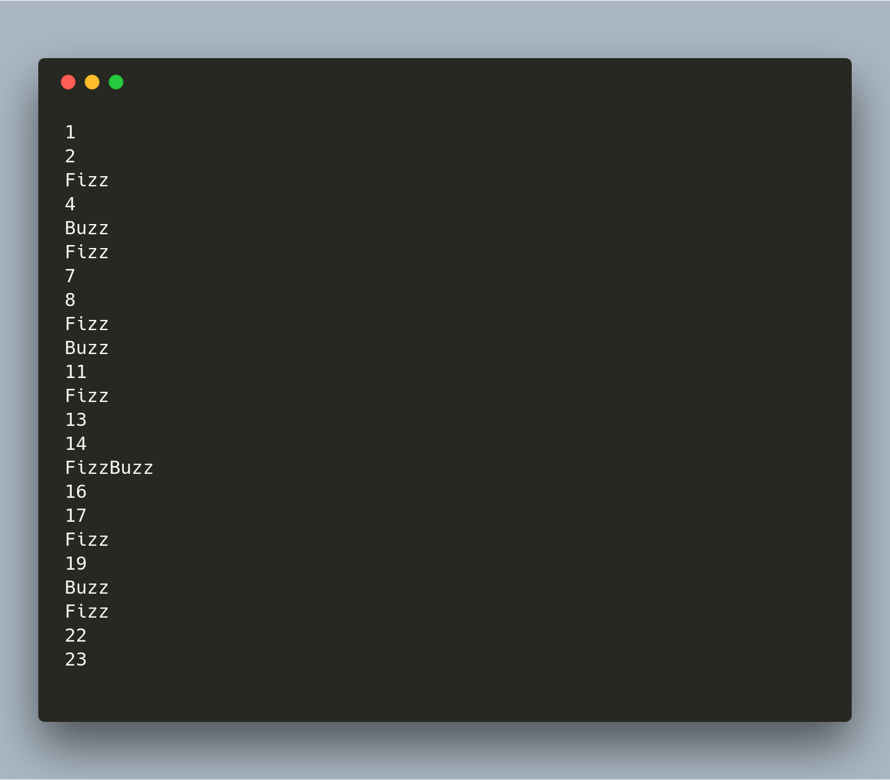

# FizzBuzzPlusPlus

FizzBuzzPlusPlus é uma implementação Cross-Platform (Linux e Windows 32 Bits ou Windows 64 Bits) de autoria minha do "Teste de FizzBuzz", feito em C++;

## O que é

O Teste de FizzBuzz é uma questão de entrevista projetada para ajudar a filtrar os 99,5% dos candidatos a empregos de programação.

Escreva um programa que imprima números. Mas, para múltiplos de três, imprima "Fizz" em vez do número. Para os múltiplos de cinco imprima "Buzz" em vez do numero. E para números que são múltiplos de três e cinco (ao mesmo tempo), imprima "FizzBuzz".

Fonte:
http://wiki.c2.com/?FizzBuzzTest
